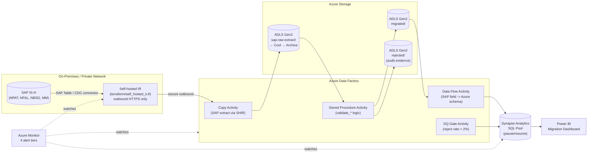

# Healthcare SAP IS-H → Azure Cloud Migration (Big Data)


**[← Back to live portfolio](https://andiswamatai.github.io)**

A large-scale migration pipeline moving SAP IS-H (Industry Solution for Healthcare) hospital data — patient records, admissions, billing, and material/pharmacy consumption — into an Azure-ready cloud schema, processing **1.13M+ rows** with chunked, memory-flat extract → validate → transform logic.

## Why this exists

Hospital groups running SAP IS-H sit on some of the most operationally critical and tightly regulated data in any industry: every admission, every billing line, every unit of medication dispensed. Migrating this to a cloud platform safely means validating every record against real clinical and financial rules before it ever reaches production — a single orphaned billing record or a discharge date before an admission date can break downstream revenue reporting.

## SAP IS-H Tables Modelled

| SAP Table | Description | Azure Target |
|---|---|---|
| NPAT | Patient master (demographics, payer category) | `az_patients` |
| NFAL | Patient case / admission record | `az_cases` |
| NBSG | Billing line items per case | `az_billing` |
| MM (Materials Mgmt) | Pharmacy/material consumption per case | `az_materials` |

## Scale

| Table | Source rows | Migrated | Rejected |
|---|---|---|---|
| Patients | 80,000 | 80,000 | 0 |
| Cases | 220,000 | 219,120 | 880 |
| Billing | 520,000 | 516,357 | 3,643 |
| Materials | 310,000 | 308,765 | 1,235 |
| **Total** | **1,130,000** | **1,124,242** | **5,758 (0.51%)** |

Full pipeline (generate + migrate) runs in under 40 seconds.

## Architecture

```
SAP IS-H flat-file extract (1.13M rows)
        │
        ▼
[Phase 1: Extract + Validate]  — chunked, 50K rows/chunk
   • Missing facility on case record
   • Discharge date before admission date
   • Orphan case references in billing/materials
   • Zero/negative billing amounts
        │
        ├── REJECTED ──▶ logged with rejection reason
        │
        ▼
[Phase 2: Transform]
   • SAP field codes → business names (GESCH 1/2/9 → male/female/unknown)
   • SAP date format (YYYYMMDD) → ISO 8601
   • Computed fields: length_of_stay_days, total_cost
        │
        ▼
   az_patients / az_cases / az_billing / az_materials  (Azure-ready schema)
```

## Sample Migration Run

```
Entity                  Source     Valid  Rejected
-----------------------------------------------------------------
Patients (NPAT)         80,000    80,000         0
Cases (NFAL)           220,000   219,120       880
Billing (NBSG)         520,000   516,357     3,643
Materials (MM)         310,000   308,765     1,235

Billing migrated, total value: R904,186,673.77
Total rejected: 5,758 (0.51%)
```

## Tech stack

Python, pandas with chunked processing (→ Azure Data Factory + Synapse Analytics in production), numpy for vectorised million-row data generation.

## Running it

```bash
pip install -r requirements.txt
python src/generate_sample_data.py     # ~11s, generates 1.13M rows
python src/run_migration.py            # ~25s, full extract→validate→transform
```

Run the tests (fast — isolated logic tests):

```bash
python -m unittest discover -s tests -v
```

## Production Architecture

This repo now ships the full production migration footprint: Self-hosted Integration Runtime VM, Azure Data Factory with SAP connector, ADLS Gen2 storage, Synapse Analytics, Key Vault, Log Analytics monitoring, and cost controls — provisioned via Terraform.



## What's actually runnable vs. what's reference architecture

| Component | Status |
|---|---|
| `src/generate_sample_data.py` | **Runs locally**, generates 1.13M rows in ~11s |
| `src/run_migration.py` — full extract-validate-transform | **Runs locally**, chunked pandas, no Azure account needed |
| `tests/` | **Runs locally**, 7 passing unit tests |
| `cost_optimization/cost_calculator.py` | **Runs locally**, models real savings including mandatory SHIR cost |
| `terraform/*.tf` | **Valid HCL**, `terraform validate`-able, not applied (no Azure subscription) |
| `monitoring/alert_rules.tf` | **Valid HCL**, 4 alert tiers including SHIR connectivity monitoring |
| `.github/workflows/ci.yml` | **Runs on GitHub Actions**, tests + pipeline + cost calc verified |
| `.github/workflows/terraform-plan.yml` | **Validates HCL** on every PR touching terraform/ |
| `.github/workflows/cd.yml` | **Documents the real deployment commands**, doesn't execute against live infra |

## Production readiness checklist

- [x] Infrastructure as Code (Terraform, environment-separated via `.tfvars`)
- [x] CI/CD (GitHub Actions: test → Terraform plan → deploy with DQ smoke test gate)
- [x] Self-hosted Integration Runtime provisioned as infrastructure (not a manual VM install)
- [x] ADLS Gen2 lifecycle tiering — raw SAP extracts archived after 90 days (POPIA compliance: retain, but cost-optimise cold storage)
- [x] Synapse SQL Pool pause/resume — monitored by alert rule 4 to catch forgotten "leave it running" situations
- [x] Monitoring & alerting (4 tiers: pipeline failure, rejection rate spike, SHIR offline, Synapse idle)
- [x] Cost optimization — mandatory SHIR cost documented honestly, optimisable savings ~R249K/year
- [x] PHI data classification tag on all resources — drives CMK, purge protection, HTTPS-only defaults
- [x] Key Vault purge protection enabled — required for customer-managed key scenarios on health data
- [x] Rejected records written to a separate ADLS container (the audit evidence that nothing was silently dropped)

## What I'd add next

- Add POPIA/HIPAA-compliant patient identifier pseudonymisation (SHA-256 hash of `PATNR`) before any extract leaves the SHIR VM.
- Replace the local `_sap_date()` transform with ADF Data Flow's `toDate()` expression so the transformation runs at scale in the Azure Data Flow cluster rather than locally.
- Build a Power BI migration cutover dashboard reading the `rejected/` ADLS container so the migration lead can see entity-by-entity readiness and rejection trends before go-live sign-off.

## License

MIT — all data is synthetic.
