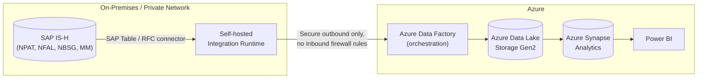

# Healthcare SAP IS-H → Azure Cloud Migration (Big Data)

A large-scale migration pipeline moving SAP IS-H (Industry Solution for Healthcare) hospital data — patient records, admissions, billing, and material/pharmacy consumption — into an Azure-ready cloud schema, processing **1.13M+ rows** with chunked, memory-flat extract → validate → transform logic.

## Why this exists

Hospital groups running SAP IS-H sit on some of the most operationally critical and tightly regulated data in any industry: every admission, every billing line, every unit of medication dispensed. Migrating this to a cloud platform safely means validating every record against real clinical and financial rules before it ever reaches production — a single orphaned billing record or a discharge date before an admission date can break downstream revenue reporting.

## SAP IS-H Tables Modelled

| SAP Table | Description | Azure Target |
|---|---|---|
| NPAT | Patient master (demographics, payer category) | `az_patients` |
| NFAL | Patient case / admission record | `az_cases` |
| NBSG | Billing line items per case | `az_billing` |
| MM (Materials Mgmt) | Pharmacy/material consumption per case | `az_materials` |

## Scale

| Table | Source rows | Migrated | Rejected |
|---|---|---|---|
| Patients | 80,000 | 80,000 | 0 |
| Cases | 220,000 | 219,120 | 880 |
| Billing | 520,000 | 516,357 | 3,643 |
| Materials | 310,000 | 308,765 | 1,235 |
| **Total** | **1,130,000** | **1,124,242** | **5,758 (0.51%)** |

Full pipeline (generate + migrate) runs in under 40 seconds.

## Architecture

```
SAP IS-H flat-file extract (1.13M rows)
        │
        ▼
[Phase 1: Extract + Validate]  — chunked, 50K rows/chunk
   • Missing facility on case record
   • Discharge date before admission date
   • Orphan case references in billing/materials
   • Zero/negative billing amounts
        │
        ├── REJECTED ──▶ logged with rejection reason
        │
        ▼
[Phase 2: Transform]
   • SAP field codes → business names (GESCH 1/2/9 → male/female/unknown)
   • SAP date format (YYYYMMDD) → ISO 8601
   • Computed fields: length_of_stay_days, total_cost
        │
        ▼
   az_patients / az_cases / az_billing / az_materials  (Azure-ready schema)
```

## Sample Migration Run

```
Entity                  Source     Valid  Rejected
-----------------------------------------------------------------
Patients (NPAT)         80,000    80,000         0
Cases (NFAL)           220,000   219,120       880
Billing (NBSG)         520,000   516,357     3,643
Materials (MM)         310,000   308,765     1,235

Billing migrated, total value: R904,186,673.77
Total rejected: 5,758 (0.51%)
```

## Tech stack

Python, pandas with chunked processing (→ Azure Data Factory + Synapse Analytics in production), numpy for vectorised million-row data generation.

## Running it

```bash
pip install -r requirements.txt
python src/generate_sample_data.py     # ~11s, generates 1.13M rows
python src/run_migration.py            # ~25s, full extract→validate→transform
```

Run the tests (fast — isolated logic tests):

```bash
python -m unittest discover -s tests -v
```

## What I'd add for production

- Replace flat-file extracts with live SAP IS-H RFC/BAPI calls via `pyrfc`
- Add POPIA/HIPAA-compliant patient identifier pseudonymisation before any data leaves the SAP environment
- Load into Azure Synapse Analytics with row-level security so clinical staff only see their facility's data
- Build a migration cutover dashboard in Power BI tracking entity-by-entity readiness and rejection trends ahead of go-live

## Production Architecture

This repo simulates the migration logic locally with chunked pandas so it runs without any SAP or Azure account. In a real hospital group migration, this is how it would actually be deployed:



**Why Self-hosted IR is mandatory here:** SAP IS-H runs inside the hospital group's private network, not reachable from the public internet. ADF's default Azure Integration Runtime cannot reach it. A **Self-hosted Integration Runtime** — a lightweight agent installed on a VM inside that network — makes a secure *outbound-only* connection to ADF, so no inbound firewall rules ever need to open. ADF's native **SAP Table** / **SAP CDC** connectors run through that SHIR to pull NPAT/NFAL/NBSG/MM extracts on a schedule, exactly mirroring the `extract_validate_*()` functions in `run_migration.py`.

Real-time clinical events (e.g. live admission/discharge feeds) would route through **Azure Event Hubs** (Kafka-compatible endpoint) or **Fabric Eventstream** rather than batch ADF pipelines, for anything needing sub-minute latency.

## License

MIT — all data is synthetic.
